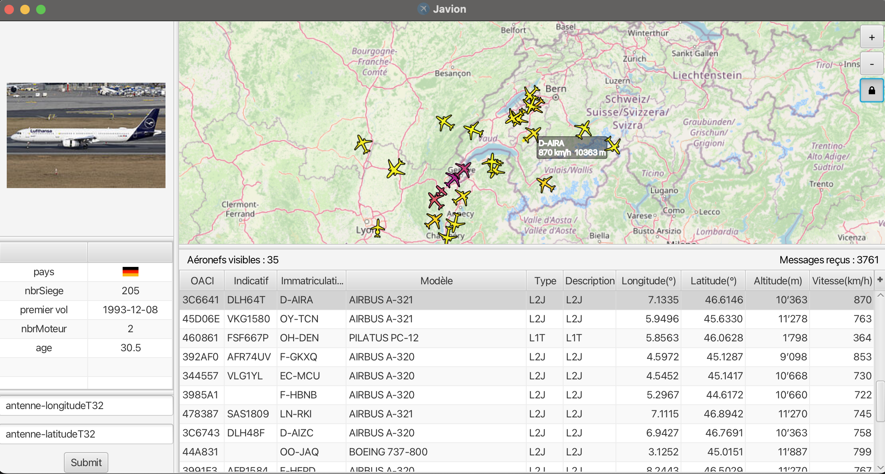

<h1 align="center">Javion </h1>

<p align="center">
  
</p>
<p align="center"><i>Track planes in real time with Javion!</i></p>

## Overview

**Javion** is an app that tracks planes in real time. This README provides instructions on how to set up and run the project in IntelliJ.

## How to Run

To run the Javion project in IntelliJ, follow these steps:

### Prerequisites

1. **Install JavaFX**:
   - Download and install JavaFX. You can get it from the [JavaFX official website](https://openjfx.io/).

2. **Add JavaFX to IntelliJ**:
   - Unzip the downloaded JavaFX SDK to a known location on your system.
   - Import JavaFX as a global library under the name `OPENJFX 20`.


### Configuration

1. **Edit Configuration**:
   - Go to `Run` > `Edit Configurations`.
   - Select your run configuration or create a new one.
   - Under `Build and Run`, click `Modify options` and add `VM options`.
   - In the `VM options` field, add the following (replace the path with your actual JavaFX lib path):
     ```
     --module-path {/path/to}/javafx-sdk-20/lib --add-modules javafx.controls -ea
     ```

2. **Add Program Arguments**:
   - In the same configuration window, find the `Program arguments` field.
   - Add the following argument:
     ```
     messages_20230520_1725.bin
     ```

   This argument is a provided binary file of recorded plane locations.

### Running the Project

1. Ensure your configuration is properly set up with the JavaFX library and program arguments.
2. Click the `Run` button to start the application.

We hope you enjoy using **Javion**!
